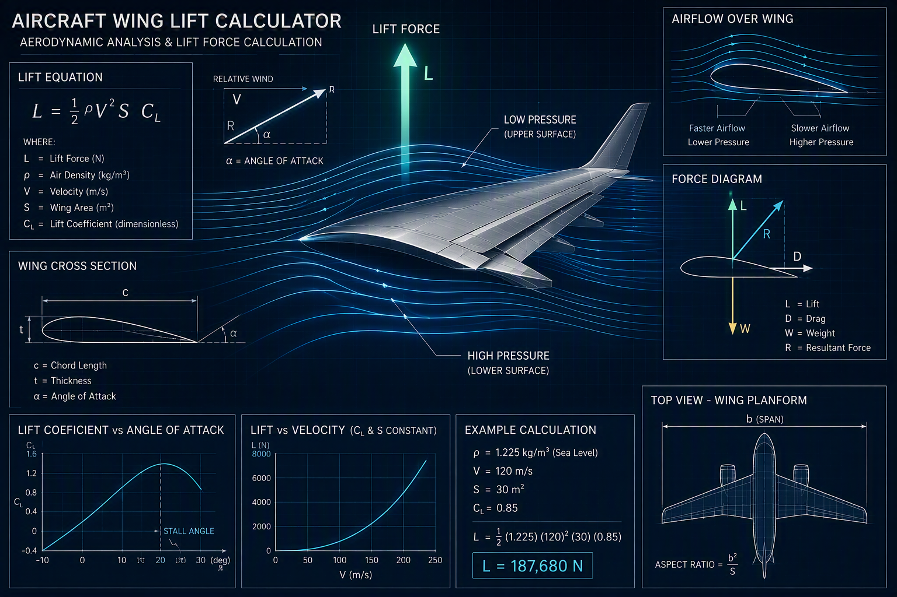

## Project Status

🚧 In Development

# Aircraft Wing Lift Calculator 

A Python-based aerospace engineering project that calculates aircraft wing lift using fundamental aerodynamic principles.

## Project Objective

The purpose of this project is to explore how wing area, air density, velocity, and lift coefficient affect aircraft lift generation.

## Research Question

How do wing characteristics and flight conditions influence the amount of lift generated by an aircraft?

## Engineering Areas
- Aerospace Engineering
- Aerodynamics
- Aviation
- Physics
- Python Programming

## Project Features

### Lift Force Calculation
Calculate aerodynamic lift using standard lift equations.
### Flight Condition Analysis
Analyze how speed and air density influence lift generation.
### Wing Performance Evaluation
Compare lift characteristics under different flight conditions.
### Data Visualization
Display lift-force relationships through graphs and charts.

## Engineering Concepts
- Lift Force
- Air Density
- Velocity
- Wing Area
- Aerodynamics

## Skills Demonstrated
- Python Programming
- Aerospace Engineering Fundamentals
- Aerodynamic
- Mathematical Modeling
- Data Analysis
- Engineering Problem Solving

  

## Future Improvements
- Multiple Wing Profiles
- Stall Analysis
- Drag Force Calculation
- Aircraft Comparison Tool
- Interactive Dashboard

## Project Files
- Python Source Code
- Lift Calculations
- Graphs and Visualizations
- [Engineering Notebook](Aircraft_Wing_Lift_Calculator_notebook.pdf)
- [Project Report ](Aircraft_Wing_Lift_Calculator_Project_Report.pdf)

## Author

Sarp AKAR

